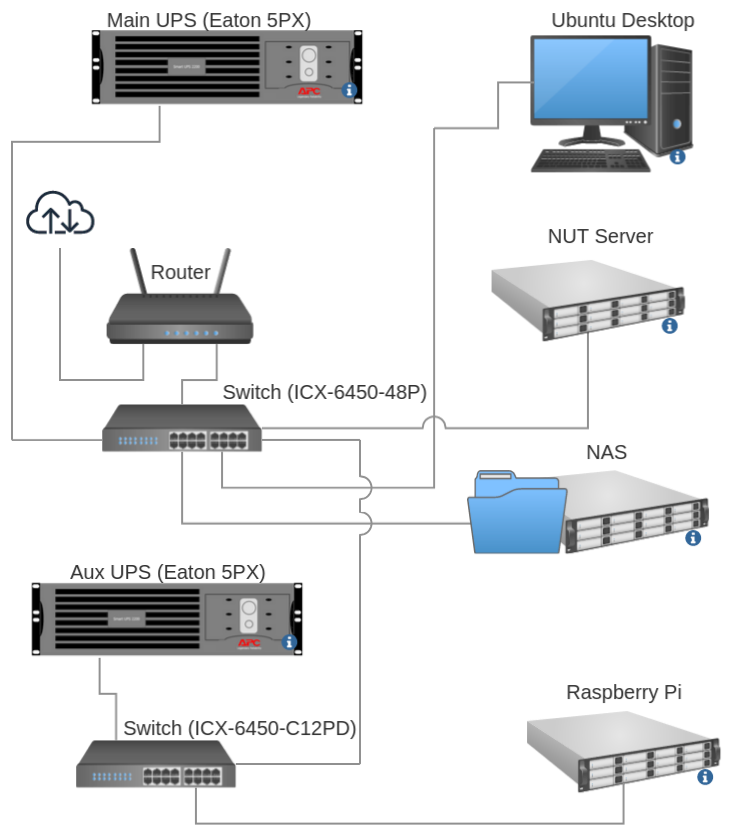

# NUT v2.8.0 Server Config
For Eaton UPS devices with the M2 network interface (SNMP)

Tested on Debian Bullseye 11 and Ubuntu 20.04

## Mandatory Disclaimer
This repository was created to help others set up their Eaton SNMP UPSes. Despite my best efforts, it should not in any way be considered a production ready implementation. My primary goal was to gain familiarity with NUT and Bash scripts while deploying the software to a handful of client machines. In conclusion, I'm not responsible for anything that goes wrong should you decide to use these deliverables and / or duplicate my efforts. You have been warned... >:-)

## Introduction
I started out with NUT v2.7.4, but quickly realized that an upgrade was necessary. v2.8.0 has a number of stability / functionality improvements for the SNMP driver and the systemd configuration as a whole. Since I wasn't able to locate an installer package for Debian or Ubuntu (as of 12/2022), I compiled and installed the tarball. If the Debian system paths are correctly set [before compilation](#configuration), everything should work as expected. The included files demonstrate how to gracefully shutdown the NUT host and any client machines that are connected to it before powering down the UPS itself.

The NUT project is exceptionally well documented and its contributors are friendly and responsive.

### Hardware
This guide only applies to UPSes running the [Eaton M2 network card](https://www.eaton.com/us/en-us/catalog/backup-power-ups-surge-it-power-distribution/eaton-gigabit-network-card---na.html). The M2 enables SNMP connectivity with various Eaton UPS devices which support it. It complies with the IETF ([RFC 1628](https://datatracker.ietf.org/doc/html/rfc1628)) standard. As of 12/2022, these cards can be obtained new on eBay for around $170 USD. 

### Client
Please review this document before proceeding to the [NUT Client Config](https://github.com/crowl0gic/nut-client-cfg) repo, as the client interfaces with the server that is described below. 

### Layout


The "NUT Server" is responsible for shutting down the following in order:
1. "Ubuntu Desktop" (runs NUT client)
2. "NAS" (runs NUT client)
3. "NUT Server" (itself) / "Raspberry Pi" (also runs a NUT client instance)
4. "Router" (receives shutdown command from /bin/upssched-cmd)
5. "Aux UPS" / "Main UPS" (receives shutdown command from /bin/upssched-cmd)

"Aux UPS" is not monitored because it's on the same feed (but different circuit) as "Main UPS." If power to "Main UPS" fails, there's no point in keeping "Aux UPS" on, even if it's still getting power.

Some devices are powered down simultaneously. The UPSes are the last devices to shut down and have a generous delay for safety. The ICX switches can be safely powered off without a manual shutdown. All devices run the NUT client and maintain contact with the "NUT Server" for updates on when the UPS is operating on battery and when / if grid power returns. Delays are set on a per-host basis with timers in /etc/nut/upssched.conf, while customized shutdown routines are in /bin/upssched-cmd.

### systemd
NUT v2.8.0 comes with extensive scripts (upsdrvsvcctl and nut-driver-enumerator.sh) to manage the UPS drivers within systemd (v2.7.4 had a minimal implementation at best). This is especially important for those of us who run the snmp drivers, as a delayed network interface under v2.7.4 causes the NUT driver to cycle indefinitely without ever establishing contact with the device

I recommend using the new systemd integration as it's a significant improvement. Any v2.8.0 binaries you compile will still function with an old v2.7.4 installation for testing purposes.

More information can be found here:

* [upsdrvsvcctl man page](https://networkupstools.org/networkupstools-master.github.io/docs/man/upsdrvsvcctl.html)
* [nut-driver-enumerator man page](https://networkupstools.org/networkupstools-master.github.io/docs/man/nut-driver-enumerator.html)

## Compiling NUT
Everything needed to compile under Debian can be found in these documents: 

* [NUT Config Prereqs](https://github.com/networkupstools/nut/blob/master/docs/config-prereqs.txt) - Install the dependencies outlined in this step first
* [NUT configuration script parameters](https://github.com/networkupstools/nut/wiki/Building-NUT-on-Debian,-Raspbian-and-Ubuntu) - Review and modify to suit your needs. The parameters I used are included below

<a name="configuration"></a>
### My configuration parameters
I used the arguments below for a barebones SNMP build. I removed all extraneous options. Defining the application paths is essential to ensure compatibility with your distribution. I identified a number of them by trial and error:

```
./configure --with-user=nut --with-group=nut --datadir=/usr/share/nut --prefix=/usr --sysconfdir=/etc/nut --with-statepath=/var/run/nut --with-altpidpath=/var/run/nut --with-drvpath=/usr/lib/nut --bindir=/usr/bin --sbindir=/usr/sbin --with-python3 --with-drivers=snmp-ups --without-serial --without-usb --without-neon --without-powerman --without-modbus --with-snmp --without-ipmi --without-freeipmi --with-doc=no --without-avahi --without-linux_i2c --with-ssl --with-nss --with-openssl --without-cgi --with-systemdsystemunitdir=/lib/systemd/system --with-pkgconfig-dir=/usr/lib/`gcc -print-multiarch`/pkgconfig
```

### Create the "nut" user and group
A group ("nut") and user ("nut") will need to be created for the service to run if you are bypassing the Debian / Ubuntu package and installing from scratch

This command will create both according to the settings used by the offical .deb package: 
```
sudo useradd -d /var/lib/nut -K UID_MIN=100 -K UID_MAX=199 -K GID_MIN=100 -K GID_MAX=199 -M -U -s /usr/sbin/nologin nut
```

### Compile NUT
I performed my testing on a VM running Debian 11 and my old Lenovo ThinkPad (both x86_64). Everything worked as expected when installing with `sudo make install`, provided that the configuration script parameters and NUT configuration files are good.
```
make all && make check && sudo make install
```

If you choose to install NUT with `sudo make install`, you'll need to establish the state path (/var/run/nut) and enable the systemd services:

#### Binaries
The NUT server and client installs differ by only 3 binaries (client does not include drivers (snmp-ups in our case), upsdrvctl, or upsd). 

Initially, I installed the official nut-server package then overwrote the binaries to verify that everything worked as expected. You'll need to install the libsnmp40 package. The following files are all you need to get the NUT server running:
```
├── bin
│   ├── upsc
│   ├── upscmd
│   ├── upslog
│   └── upsrw
├── lib
│   ├── libnutclient.a
│   ├── libnutclient.la
│   ├── libnutclient.so.2.0.0
│   ├── libnutclientstub.a
│   ├── libnutclientstub.la
│   ├── libnutclientstub.so.1.0.0
│   ├── libupsclient.a
│   ├── libupsclient.la
│   ├── libupsclient.so.6.0.0
│   └── nut
│       └── snmp-ups
├── sbin
│   ├── upsd
│   ├── upsdrvctl
│   ├── upsdrvsvcctl
│   ├── upsmon
│   └── upssched
└── usr
    └── libexec
        └── nut-driver-enumerator.sh
```

#### /usr/lib/tmpfiles.d/nut-server.conf
You can either run `sudo systemd-tmpfiles --create` or restart the system to establish this directory
```
d /run/nut 0770 root nut - -
```

#### Establish systemd services
```
sudo systemctl daemon-reload
sudo systemctl enable nut-driver-enumerator.path
sudo systemctl enable nut-driver-enumerator.service
sudo systemctl enable nut-driver@.service
sudo systemctl enable nut-monitor.service
sudo systemctl enable nut-server.service
sudo systemctl enable nut-driver.target
sudo systemctl enable nut.target
```

#### Invoke driver instances with /sbin/upsdrvsvcctl
Run this once you have device entries defined in /etc/nut/ups.conf. One or more entries will be configured for your devices. 

The configuration files provided with this repo should be a good starting point
```
sudo /sbin/upsdrvsvcctl reconfigure
```

#### Start monitor and server
```
sudo systemctl start nut-server
sudo systemctl start nut-monitor
```
You should now be able to review the status of your UPS device(s) by running `upsc upsname`
Available UPS commands can be reviewed with:
```
upscmd -l upsname
upsrw -l upsname
```
Outside of some differences in syntax, these programs are interchangeable in function. See the [/etc/nut/ups.conf](#ups.conf) section for an example.

## Configuring NUT
I included the notes I took for each section below

### /etc/nut/nut.conf
NUT server contains `MODE=netserver` if other systems will be depending on it for updates

<a name="ups.conf"></a>
### /etc/nut/ups.conf
The `pw` mibs had a couple more working features than `ietf`. For example, `pw` enables you to shut down outlet groups on the Eaton 5PX with `upscmd`. `ietf` enabled a beeper mute command and battery test through `upscmd`, but the latter didn't work. Shutdowns for `ietf` are performed through `upsrw`, while `pw` uses `upscmd`. Neither appear to be capable of shutting down the UPS via `/sbin/upsmon -c fsd` or `/lib/nut/snmp-ups -a upsname -k`. `ietf` metrics ( from `upsc uspname`) had some minor inconsistencies. Otherwise, the two mibs are similar.

Note 1: You can get a list of available mibs by running `/lib/nut/snmp-ups -a upsname -x mibs=--list`

Note 2: If you're running the updated systemd scripts, changing this file will result in an automatic restart of the driver

### /etc/nut/upsd.conf
Enable the `LISTEN` command, use 0.0.0.0 to enable external addresses. Do not leave this exposed on public networks!

### /etc/nut/upsd.users
Define users with access to the NUT UPS server

The "slave" user will probably not need access to the `actions` or `instcmds` permissions. You can leave these fields out for accounts which do not need them.

### /etc/nut/upsmon.conf
1. Define which UPS(es) you will be monitoring here
2. `MINSUPPLIES` will probably be 1
3. You can use a `SHUTDOWNCMD` similar to `SHUTDOWNCMD "/usr/bin/logger fake shutdown command"` to speed up your testing process
4. Define the `NOTIFYCMD` and `NOTIFYFLAG`s that will be used (varies by driver / UPS capabilities). I'm only using `ONBATT` and `ONLINE`.

### /etc/nut/upssched.conf
Determines what occurs at specific UPS events. Sets the shutdown timer that will be used to shut off the host and complement processes.

Be sure to uncomment the `CMDSCRIPT` and `PIPEFN` parameters and set appropriate paths

The timer you configure here determines when the server will shutdown. It's important to ensure that your shutdowns are synchronized!

### /bin/upssched-cmd
May have world readable permissions by default. Mine is set to 750 with read access for the nut group since it contains NUT-specific passwords. 
```
sudo chmod 750 /bin/upssched-cmd
sudo chown root:nut /bin/upssched-cmd
```

In the `onbatt_shutdown` routine, if 5 minutes have passed:
* I call a script to shut down my router in 30s and the "Raspberry Pi" immediately
* I shut down the "Main UPS" in 60s
* I shut down the "Aux UPS" in 60s
* I call `/sbin/upsmon -c fsd` to shutdown the "NUT Server" immediately

### /lib/systemd/system-shutdown/nutshutdown
I commented out the single line in this file as it doesn't pertain to the snmp-ups configuration

### NUT systemd updates
These files comprise the updated NUT v2.8.0 systemd configuration. They are not included with this repo

* /sbin/upsdrvsvcctl 
* /usr/libexec/nut-driver-enumerator.sh
* /lib/systemd/system/nut-driver-enumerator.path
* /lib/systemd/system/nut-driver-enumerator.service
* /lib/systemd/system/nut-driver<i></i>@.service
* /lib/systemd/system/nut-driver.target
* /lib/systemd/system/nut-monitor.service
* /lib/systemd/system/nut-server.service
* /lib/systemd/system/nut.target

